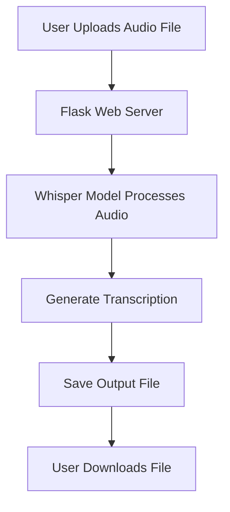

# Whisper AI Transcription Tool 🎙️

[](LICENSE)
[](https://www.python.org/)
[](https://flask.palletsprojects.com/)
[](https://github.com/openai/whisper)

> **Convert your audio files into accurate transcriptions and translations using state-of-the-art AI technology.**

---

## 🌟 Features

- **Multi-format Output**: Generate transcripts in `.txt`, `.srt`, or `.json` formats.
- **Language Support**: Automatic language detection or specify a target language.
- **Translation**: Translate audio content into English.
- **Web UI**: User-friendly interface for uploading and downloading files.
- **Scalable**: Built with Flask and optimized for performance using CUDA (GPU acceleration).

---

## 🛠️ How It Works

The application uses OpenAI's **Whisper model** to process audio files and generate transcriptions. Here's the workflow:

### Architecture Diagram



🚀 Setup Guide
Directory Structure
Create the following directory structure to organize the project:

### Directory Setup

```bash
# Create project directories
!mkdir -p /content/whisper-app
!mkdir -p /content/whisper-app/outputs
!mkdir -p /content/whisper-app/static/css
!mkdir -p /content/whisper-app/static/js
!mkdir -p /content/whisper-app/templates
```

# Install Dependencies
Install the required Python packages:
### Install required packages
```bash
!pip install -q faster-whisper flask flask_cors pyngrok
```

# Run the Application
### 1. Save the app.py script to the project directory:
```bash
%%writefile /content/whisper-app/app.py
```
Paste the provided app.py code into this file.
### 2.Start the Flask server:
```bash
python /content/whisper-app/app.py
```
### 3.Access the application at the URL provided by ngrok.


## 🎯 Usage

### Transcription Workflow

1. **Upload Audio**: Use the web interface to upload an audio file.
2. **Select Options**:
   - Choose the output format (`txt`, `srt`, `json`).
   - Specify the language or enable automatic detection.
   - Enable translation if needed.
3. **Process**: Click "Transcribe" to start processing.
4. **Download**: Once completed, download the generated file.

### API Endpoints

| Endpoint          | Method | Description                              |
|-------------------|--------|------------------------------------------|
| `/`               | GET    | Home page (web interface).               |
| `/transcribe`     | POST   | Transcribe or translate an audio file.   |
| `/download/<filename>` | GET    | Download the processed file.             |
| `/health`         | GET    | Health check endpoint.                   |


### How it will render:
---

## 🤝 Contributing

We welcome contributions! Please follow these steps:

1. Fork the repository.
2. Create a new branch:
   ```bash
   git checkout -b feature/YourFeatureName
   ```
3. Commit your changes :
   ```bash
   (git commit -m "Add some feature")
   ```
4. Push to the branch :
   ```bash
    (git push origin feature/YourFeatureName)
   ```
5. Open a pull request.


## 📜 License

This project is licensed under the MIT License. See the [LICENSE](LICENSE) file for details.


## 🙏 Acknowledgments

- [OpenAI Whisper](https://github.com/openai/whisper): The core transcription model.
- [Flask](https://flask.palletsprojects.com/): The web framework used.
- [Ngrok](https://ngrok.com/): For exposing the local server to the internet.
